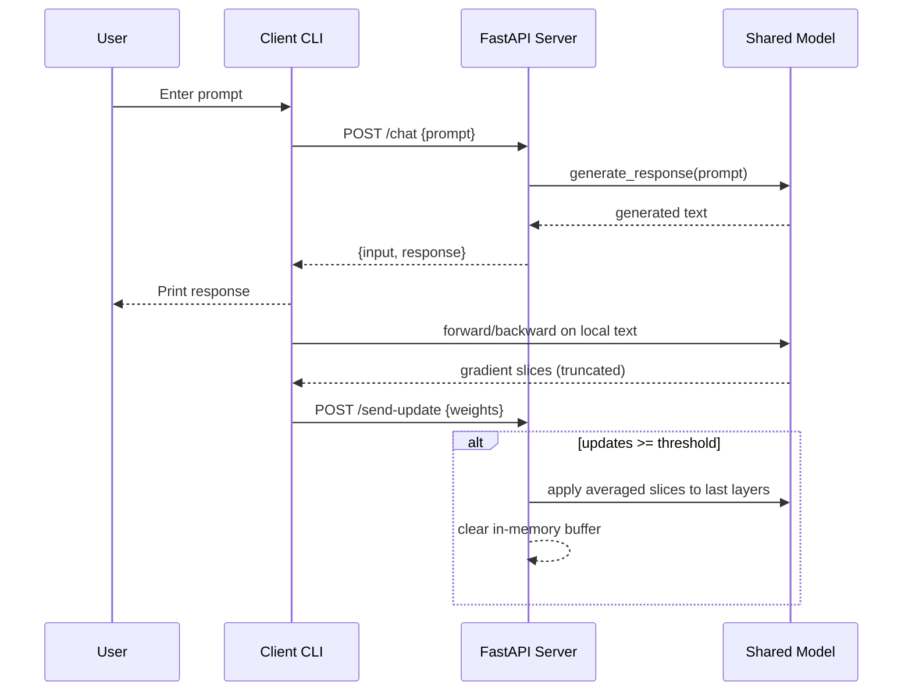

# PrivaLoom Architecture

Last updated: 2026-04-04

## 1. Purpose of this document

This document describes the current architecture of PrivaLoom as implemented in the repository today, plus the intended target architecture reflected in the project vision documents.

It is meant to be a technical reference for:
- developers onboarding to the codebase
- reviewers evaluating privacy and system design trade-offs
- future contributors implementing roadmap phases

## 2. System summary

PrivaLoom is a privacy-oriented distributed learning prototype built around a small language model workflow. It currently supports:
- local text generation via a Python CLI
- FastAPI-based chat inference endpoint
- client-to-server update exchange simulation
- basic gradient-slice aggregation and selective model updates

The long-term direction is a privacy-preserving federated learning system where raw user data remains on-device and only protected learning signals are shared.

## 3. Current repository architecture

## 3.1 Top-level layout

- `main.py`: standalone local chat loop using the model loader
- `requirements.txt`: pinned runtime dependencies
- `data.txt`: optional local training samples for one-time dataset pass in client flow
- `client/client.py`: interactive client that talks to server and sends update payloads
- `server/api.py`: FastAPI application exposing chat and update endpoints
- `model/download_model.py`: bootstrap script to download and persist DistilGPT2 artifacts
- `model/load_model.py`: shared model/tokenizer loading and text generation
- `docs/PROJECT_BIBLE.md`: product and philosophy document
- `docs/roadmap.sh`: implementation roadmap phases
- `docs/CHANGELOG.md`: chronological development log

## 3.2 Component responsibilities

### Model component (`model/`)

Primary responsibility:
- provide a single shared loading path for model + tokenizer
- persist downloaded model artifacts locally for subsequent runs
- expose response generation utility used by both CLI and API

Current behavior:
1. Check whether `model/config.json` exists.
2. If present, load local model assets from `./model`.
3. If absent, load `distilgpt2` from Hugging Face and save artifacts into `./model`.
4. Expose `generate_response(prompt)` using stochastic sampling.

Key implementation choices:
- `use_fast=False` tokenizer setting (slow tokenizer fallback)
- sampling parameters in generation path:
  - `max_length=100`
  - `do_sample=True`
  - `temperature=0.9`
  - `top_k=50`
  - `top_p=0.95`

### Server component (`server/`)

Primary responsibility:
- inference API for chat requests
- update ingestion and aggregation
- selective model weight updates after a threshold

Endpoints:
- `GET /` health message
- `POST /chat` prompt in, generated response out
- `POST /send-update` receives weight/gradient slices from clients

Aggregation/update logic:
- global in-memory buffer: `global_updates`
- threshold: `UPDATE_THRESHOLD = 2`
- once threshold reached:
  1. average incoming updates element-wise
  2. apply averaged slices to last 5 model parameters
  3. clear buffer

Operational notes:
- no persistence for buffered updates
- no model checkpoint save after updates
- no authentication/authorization on endpoints
- no multi-process synchronization for shared global state

### Client component (`client/`)

Primary responsibility:
- interactive user session
- request chat responses from server
- compute local gradients and submit compact updates

Current flow per session:
1. Prompt user for input.
2. Call `POST /chat` and display response.
3. On first loop only, run one-time dataset training pass:
   - load non-empty lines from `data.txt`
   - compute updates per sample
   - aggregate updates locally
4. On later loops, compute update only from current input.
5. Send update payload to `POST /send-update`.

Local update extraction details:
- run forward/backward with language modeling loss
- per parameter gradient:
  - flatten tensor
  - keep only first 2 values
- keep only first 5 parameter gradient slices total

### Standalone CLI (`main.py`)

Primary responsibility:
- direct local chatbot without server/client split

Behavior:
- simple infinite loop: input -> `generate_response()` -> print

### Documentation (`docs/`)

Purpose:
- define vision (`PROJECT_BIBLE.md`)
- track implementation evolution (`CHANGELOG.md`)
- maintain phased roadmap (`roadmap.sh`)

## 4. Runtime architecture and data flow

## 4.1 Mode A: local single-process chat

`main.py` -> `model/load_model.py` -> local model inference -> console output

Characteristics:
- no network dependencies
- fastest path for quick validation
- no distributed update simulation

## 4.2 Mode B: distributed simulation (client + server)

1. User enters text in client CLI.
2. Client sends prompt to server `/chat`.
3. Server uses shared model instance to generate text.
4. Client computes local gradient slices.
5. Client posts slices to server `/send-update`.
6. Server buffers updates and applies average after threshold.

## 4.3 Sequence diagram (current behavior)



## 5. API contract

## 5.1 `GET /`

Response:
```json
{
  "message": "Server is running"
}
```

## 5.2 `POST /chat`

Request:
```json
{
  "prompt": "Hello"
}
```

Response:
```json
{
  "input": "Hello",
  "response": "Generated text..."
}
```

## 5.3 `POST /send-update`

Request (shape):
- `weights`: list of slices
- each slice: list of floats

Example:
```json
{
  "weights": [
    [0.001, -0.003],
    [0.005, 0.002],
    [-0.001, 0.0004]
  ]
}
```

Response:
```json
{
  "status": "update received"
}
```

## 6. Model and artifact lifecycle

Source model:
- base model name: `distilgpt2`

Artifact behavior:
- if local model files exist, load from `./model`
- otherwise download from Hugging Face and store locally

Artifact files expected in `model/`:
- `config.json`
- `generation_config.json`
- tokenizer files
- `model.safetensors`

Version control policy:
- `.gitignore` excludes `model/*`
- exceptions keep `model/*.py` and `model/__init__.py`
- practical result: large binary artifacts are not committed

## 7. Privacy and trust boundaries

## 7.1 Intended philosophy (target)

From project docs, the target architecture is:
- keep sensitive data local
- share privacy-preserving update signals only
- aggregate knowledge centrally without collecting raw data

## 7.2 Current implementation reality

What is currently true:
- local update extraction exists
- no raw dataset file upload endpoint exists
- server receives compact numeric updates

Gaps to target model:
- raw prompt text is still sent to server for `/chat`
- updates are not noised (no differential privacy yet)
- updates are not encrypted in transit/payload (beyond optional transport security)
- no secure aggregation protocol
- no client attestation, auth, or anti-poisoning controls

## 7.3 Threat considerations (current)

Main risks at current stage:
- prompt privacy leakage through server-side chat calls
- model poisoning via unauthenticated update endpoint
- replay/spam of updates due missing client identity and nonce strategy
- state loss on server restart (in-memory buffers only)

## 8. Design trade-offs in current prototype

- Simplicity over correctness of full FL protocol
- Fast iteration over production-grade privacy/security
- Low payload size (gradient truncation) over update fidelity
- In-memory update application over durable model/version management

These are valid for a prototype phase but must be addressed before real privacy claims or production deployment.

## 9. Scalability and operations notes

Current limitations:
- single-process global model object
- no worker-safe parameter update synchronization
- no queueing or backpressure for updates
- no metrics pipeline
- no persistence layer for updates/checkpoints

Minimum operational hardening path:
1. add structured logging and request IDs
2. persist accepted updates and model checkpoints
3. separate inference-serving model from training-update model
4. add endpoint authentication and rate limits
5. isolate aggregation loop from HTTP request thread

## 10. Testing and quality status

Present state inferred from repository:
- no automated tests checked in
- no CI pipeline definitions present
- validation appears manual via CLI/server runs

Recommended near-term tests:
- API schema and status tests for each endpoint
- aggregation correctness tests with deterministic synthetic updates
- regression tests for model loading fallback behavior
- client loop test ensuring one-time dataset training logic

## 11. Roadmap alignment map

Roadmap progress (based on changelog + source):
- Phase 1 model setup: implemented
- Phase 2 project structure: implemented
- Phase 3 backend API: partially implemented (`/get-model` not present)
- Phase 4 client endpoint: implemented
- Phase 5 basic aggregation: implemented
- Phase 6 real gradients: partially implemented (compact slices)
- Phase 7 update mapping/selective layers: partially implemented
- Phase 8 privacy layer: not implemented
- Phase 9 frontend: not implemented
- Phase 10 multi-client simulation: manual only, no harness
- Phase 11 testing/demo hardening: mostly pending

## 12. Suggested next architecture milestones

1. Split chat inference from training update channels.
2. Add model versioning and explicit checkpoint save/load strategy.
3. Introduce transport security assumptions and auth strategy.
4. Implement DP noise and clipping in client update generation.
5. Add secure aggregation-compatible update protocol.
6. Build a minimal frontend status panel for demo transparency.

## 13. Glossary

- FL: Federated Learning
- DP: Differential Privacy
- Update slice: compact subset of flattened gradient values
- Aggregation threshold: number of buffered updates needed before applying
- Selective update: applying updates only to chosen parameter subsets

## 14. References inside this repository

- `docs/PROJECT_BIBLE.md`
- `docs/roadmap.sh`
- `docs/CHANGELOG.md`
- `model/load_model.py`
- `model/download_model.py`
- `server/api.py`
- `client/client.py`
- `main.py`
